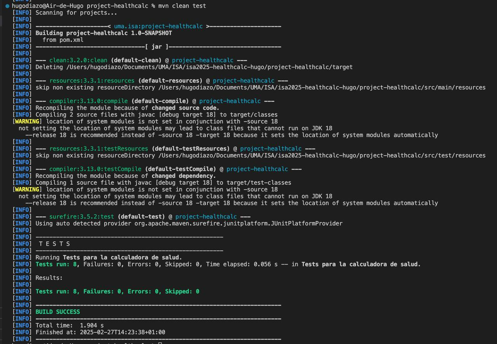
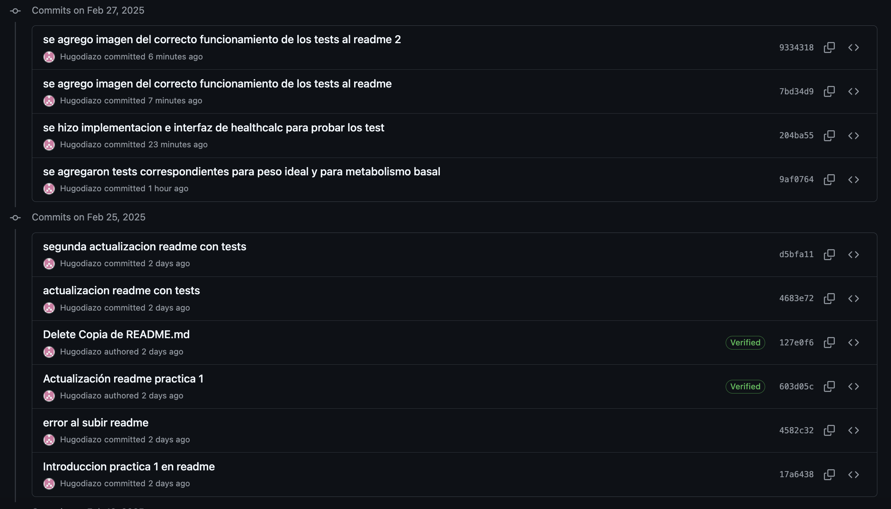
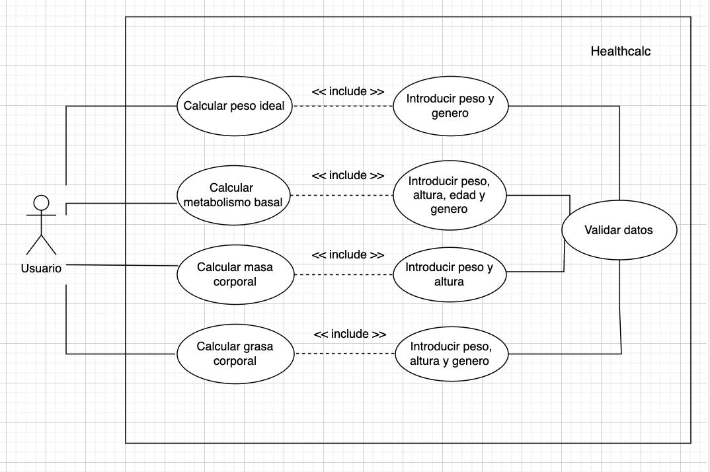

# isa2025-healthcalc
Health calculator used in Ingeniería del Software Avanzada.

Vamos a desarrollar una calculadora que permita estimar varios parámetros de salud de una persona,
como su peso ideal o su tasa metabólica basal (TMB).

# Practica 1

Con la altura y el género de una persona como entrada, obtenemos como salida su peso ideal.
Con el peso, altura, género y edad de una persona como entrada, obtenemos como salida su metabolismo basal.

Despues de leer el capitulo “A Self-Assessment Test” del libro “The art of software testing”, entendemos como las pruebas de software se volvieron más complejas debido a la diversidad de tecnologías, pero también más fáciles gracias a todas las nuevas herramientas; como asi tambien la importancia que tienen las mismas.

## Test para peso ideal:

1.	Calculo normal para hombre
Entrada: height = 175, gender = 'M'
Salida esperada: 68.75 kg
2.	Calculo normal para mujer
Entrada: height = 160, gender = 'F'
Salida esperada: 55.5 kg
3.	Altura invalida (negativa o irreal)
Entrada: height = -50, gender = 'M'
Salida esperada: Excepción indicando que la altura no es válida.
4.	Genero invalido
Entrada: height = 170, gender = 'X'
Salida esperada: Excepción indicando que el genero solo puede ser ‘M’ o ‘F’.

## Test para metabolismo basal:

5.	Calculo normal para hombre
Entrada: weight = 70, height = 175, age = 25, gender = 'M'
Salida esperada: 1668 kcal/día
6.	Calculo normal para mujer
Entrada: weight = 60, height = 165, age = 30, gender = 'F'
Salida esperada: 1400 kcal/día
7.	Peso invalido (muy bajo o muy alto)
Entrada: weight = 10, height = 170, age = 25, gender = 'M'
Salida esperada: Excepción indicando que el peso no es válido.
8.	Edad invalida (menor a 0 o mayor a 120 años)
Entrada: weight = 70, height = 175, age = -5, gender = 'M'
Salida esperada: Excepción indicando que la edad no es válida.

## Resultado tests!

## Commits de la practica 1:

# Practica 2

En esta practica empezamos creando las ramas para la practica 1 y 2.
Luego vamos a hacer un diagrama de casos de uso para nuestra healthcalc, que teniamos hasta el momento y le vamos a agregar 2 nuevas funcionalidades, la primera (que nos pide la practica) es para calcular la masa corporal de una persona, y la segunda (una pensada por nosotros) es para calcular la grasa corporal de una persona.

## Diagrama de casos de uso:

## Especificacion de Casos de Uso para el calculo del Indice de masa corporal:

Nombre: Calculo del indice de masa corporal

Actor principal: Usuario

Ambito: Healthcalc

Nivel: Usuario

Stakeholders e intereses:
  - Usuario: Quiere conocer su indice de masa corporal para evaluar su estado fisico.
Precondiciones:
  - El usuario debe ingresar su peso en kg y su altura en metros
Garantias minimas:
  - Obtener resultado valido segun la formula del indice de masa corporal
Garantia de exito:
  - El usuario recibe su resultado en una de las siguientes categorias: peso bajo, normal, sobrepeso, obesidad
Escenario principal:
  1. El usuario accede a la calculadora
  2. El usuario ingresa su peso y altura
  3. El sistema calcula el indice de masa corporal con la formula: peso / (altura^2)
  4. El sistema muestra el resultado y la categoría correspondiente
Escenarios alternativos:
  2a. Si el usuario ingresa un valor no numerico, el sistema muestra un error y pide ingresar datos validos
  3a. Si el usuario deja un campo vacio, el sistema muestra un mensaje de error
Extensiones:
  2b. Se podria agregar una recomendacion basada en el resultado del calculo del indice de masa corporal 
