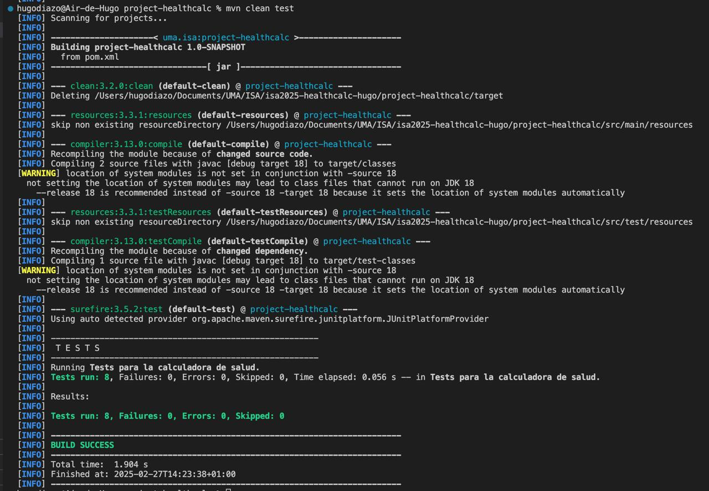
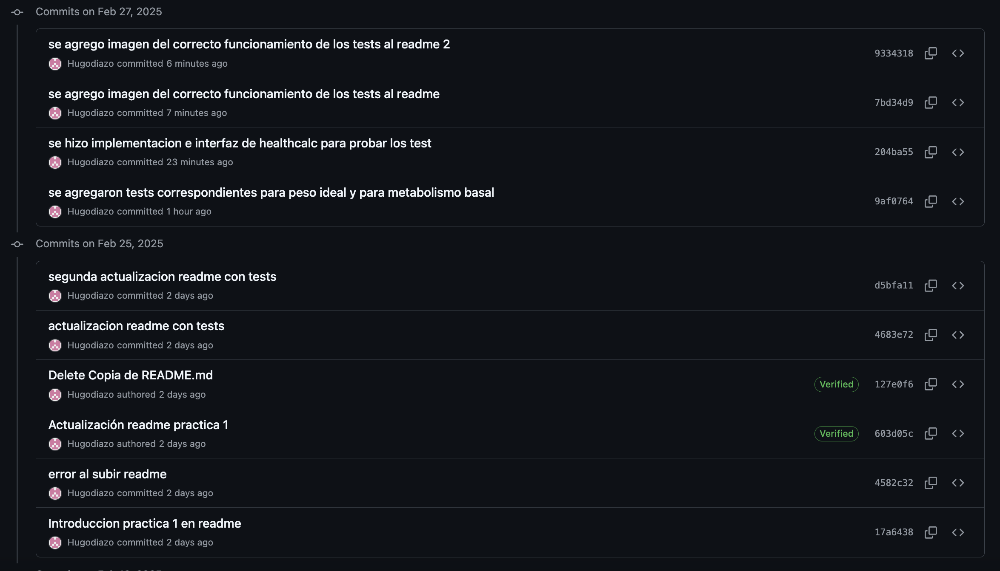
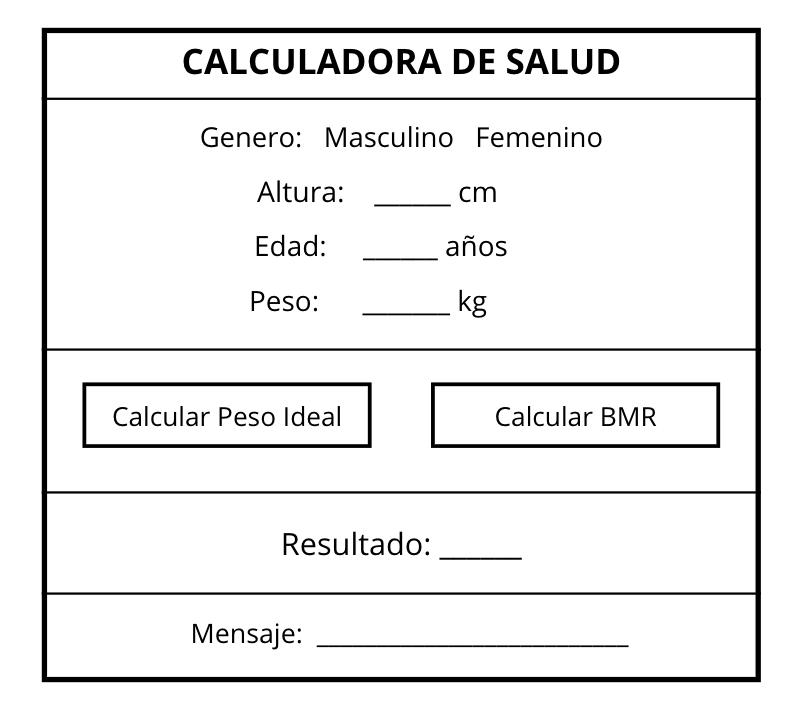
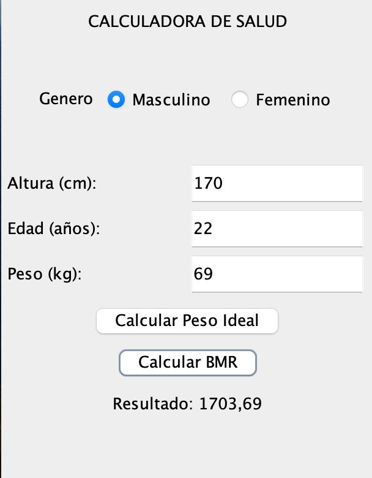
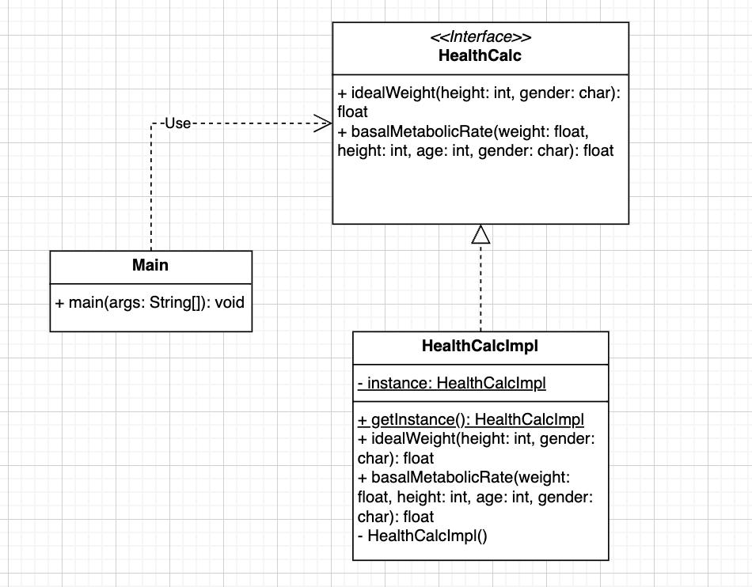
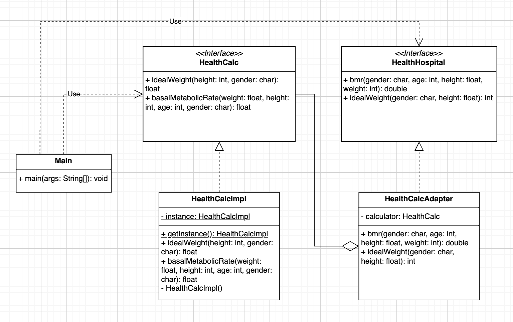
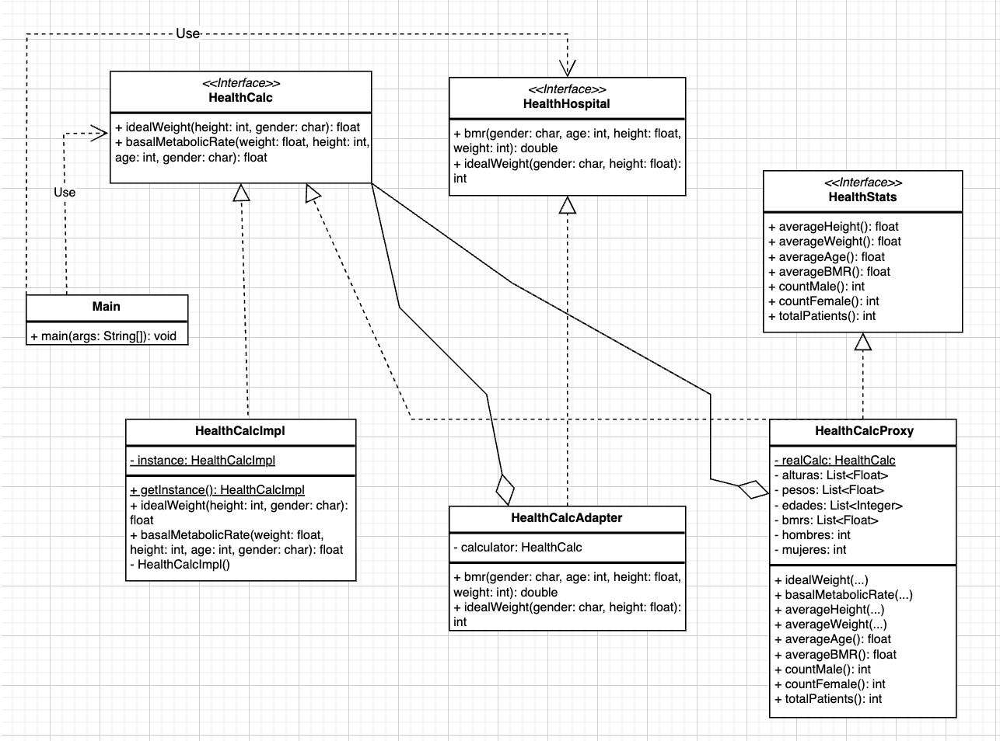
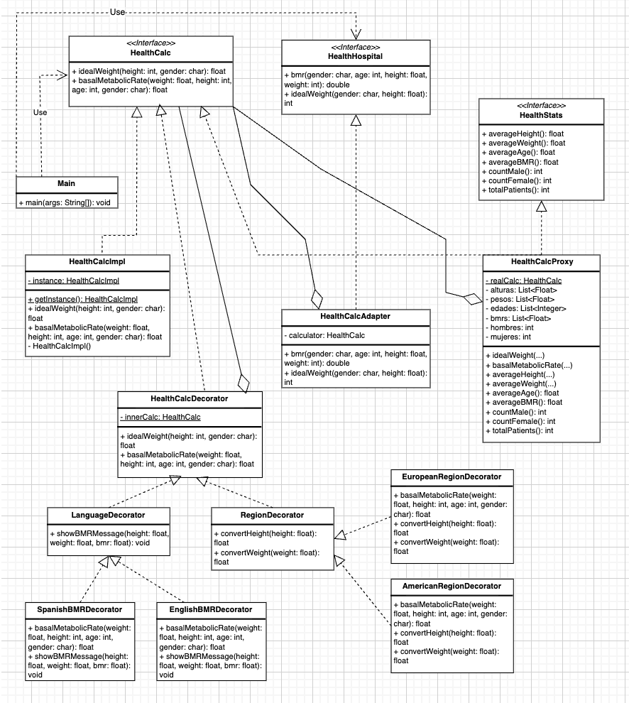
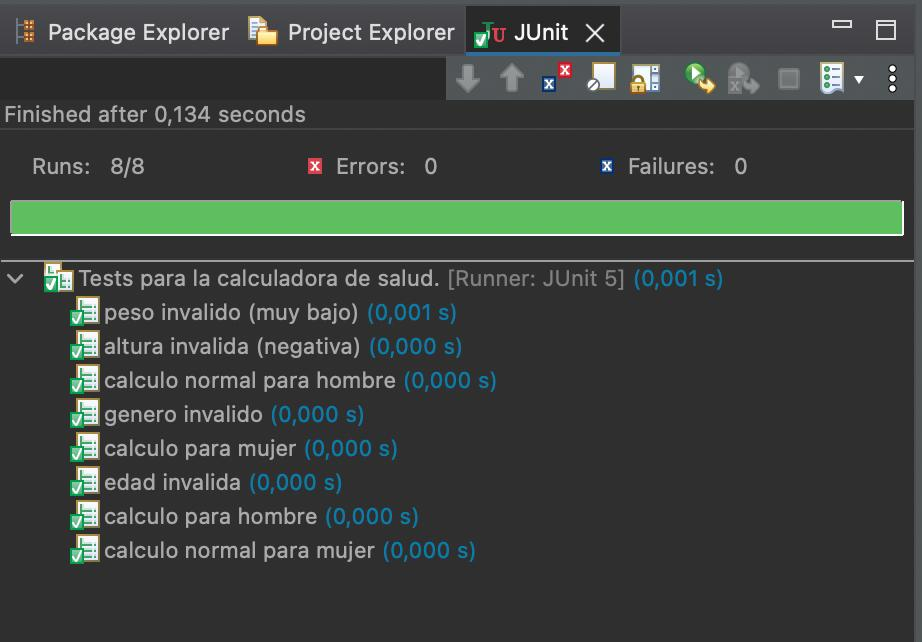

# isa2025-healthcalc
Health calculator used in Ingeniería del Software Avanzada.

Vamos a desarrollar una calculadora que permita estimar varios parámetros de salud de una persona,
como su peso ideal o su tasa metabólica basal (TMB).

## Practica 1

Con la altura y el género de una persona como entrada, obtenemos como salida su peso ideal.
Con el peso, altura, género y edad de una persona como entrada, obtenemos como salida su metabolismo basal.

Despues de leer el capitulo “A Self-Assessment Test” del libro “The art of software testing”, entendemos como las pruebas de software se volvieron más complejas debido a la diversidad de tecnologías, pero también más fáciles gracias a todas las nuevas herramientas; como asi tambien la importancia que tienen las mismas.

Test para peso ideal:

1.	Calculo normal para hombre
Entrada: height = 175, gender = 'M'
Salida esperada: 68.75 kg
2.	Calculo normal para mujer
Entrada: height = 160, gender = 'F'
Salida esperada: 55.5 kg
3.	Altura invalida (negativa o irreal)
Entrada: height = -50, gender = 'M'
Salida esperada: Excepción indicando que la altura no es válida.
4.	Genero invalido
Entrada: height = 170, gender = 'X'
Salida esperada: Excepción indicando que el genero solo puede ser ‘M’ o ‘F’.

Test para metabolismo basal:

5.	Calculo normal para hombre
Entrada: weight = 70, height = 175, age = 25, gender = 'M'
Salida esperada: 1668 kcal/día
6.	Calculo normal para mujer
Entrada: weight = 60, height = 165, age = 30, gender = 'F'
Salida esperada: 1400 kcal/día
7.	Peso invalido (muy bajo o muy alto)
Entrada: weight = 10, height = 170, age = 25, gender = 'M'
Salida esperada: Excepción indicando que el peso no es válido.
8.	Edad invalida (menor a 0 o mayor a 120 años)
Entrada: weight = 70, height = 175, age = -5, gender = 'M'
Salida esperada: Excepción indicando que la edad no es válida.

Resultado tests!

Commits de la practica 1:

## Practica 4: Interfaz grafica de usuario

### Mockup

### Interfaz final

### Como ejecutar la calculadora?

java -jar project-healthcalc.jar

## Practica 5 - Evaluacion de apps

Los formularios de evaluacion se encuentran en la carpeta "evaluation", archivo "app-1-2.pdf"

## Practica 6: Patrones de diseño

### Singleton

Asegurar una unica instancia de la calculadora con el metodo getInstance().

### Adapter hospital-Singleton

Adapter: HealthCalcAdapter implementa la interfaz HealthHospital y adapta las unidades de medida  a las del hospital para reutilizar la logica de la interfaz HealthCalc.

### Proxy - HealthStats

Proxy para agregar estadisticas a la calculadora de salud.

### Decorator - idiomas

Decorator para poder mostrar el mensaje de resultado de BMR en diferentes idiomas (español o ingles).

## Practica 7: Refactorings

### 1. Extraccion de clase para "persona"

1) Bad smell: Data Clumps  
2) Refactoring aplicado: Extract Class  
3) Tipo: Class refactoring  
4) Se creo la interfaz "Person" para representar de forma encapsulada los datos de una persona (peso, altura, edad y genero), que antes eran pasados por separado a varios metodos.  
5) Cambios: 3 clases modificadas

### 2. Reemplazo de multiples parametros por un objeto "Person"

1) Bad smell: Long Parameter List  
2) Refactoring aplicado: Introduce Parameter Object  
3) Tipo: Method refactoring  
4) Se modificaron los metodos "basalMetabolicRate" y "idealWeight" en las interfaces "MetabolicMetrics" y "CardiovascularMetrics" para que reciban un objeto "Person", reduciendo la cantidad de parametros.  
5) Cambios: 3 metodos actualizados.

### 3. Reemplazo primitivo por enumerado "Gender"

1) Bad smell: Primitive Obsession  
2) Refactoring aplicado: Replace Primitive with Enum  
3) Tipo: Attribute refactoring  
4) Se reemplazo el uso de "char" para representar el genero por un tipo "enum Gender", con valores `MALE` y `FEMALE`, que es mas seguro.  
5) Cambios: 2 clases modificadas y 1 enum creado.

### 4. Renombrado de metodos poco claros

1) Bad smell: Unclear Name  
2) Refactoring aplicado: Rename Method  
3) Tipo: Method refactoring  
4) Se renombraron los metodos "idealWeight" a "calculateIdealWeight" y "basalMetabolicRate" a "calculateBMR" en la interfaz "HealthCalc" y por ende en toda la calculadora afectada por HealthCalc.  
5) Cambios: 2 metodos renombrados, 8 clases modificadas (HealthCalc, HealthCalcImpl, HealthCalcAdapter, Main, HealthCalcProxy, HealthCalcTest, decoradores, GUI-Controller)

Todos los refactorings fueron aplicados exitosamente. El proyecto compila sin errores y todos los tests de las practicas anteriores siguen pasando correctamente, como vemos en la siguiente imagen.

